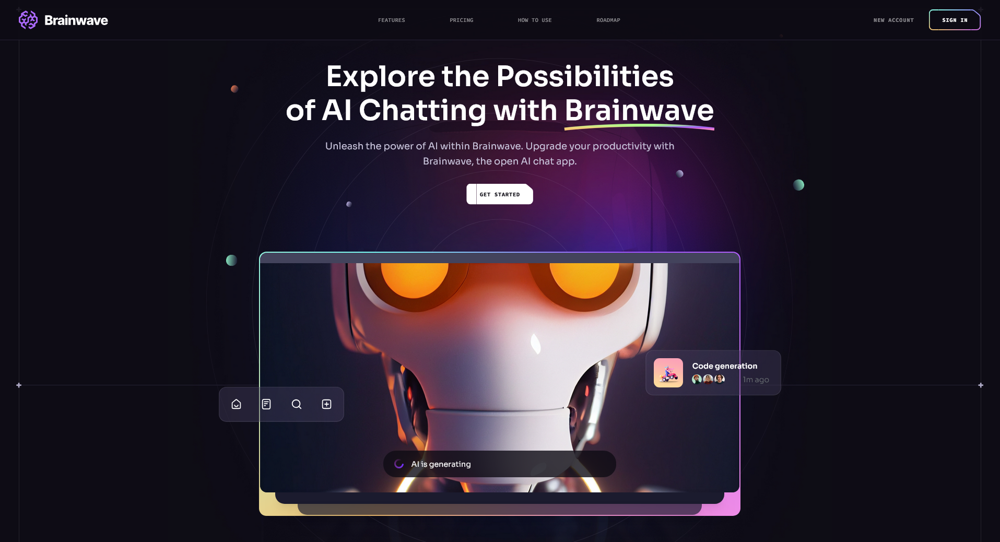

<div align="center">

# 🧠 Brainwave Landing Page

[](https://choosealicense.com/licenses/mit/)
[](https://reactjs.org/)
[](https://vitejs.org/)
[](https://tailwindcss.com/)

Modern, responsive landing page for an AI-powered chat application built with React, Vite, and Tailwind CSS.

[Report Bug](https://github.com/AvishkaGihan/brainwave/issues) • [Request Feature](https://github.com/AvishkaGihan/brainwave/issues)



</div>

---

## ✨ Features

🎨 **Beautiful UI/UX**

- Responsive design that works on all devices
- Smooth animations and transitions
- Modern, clean interface

🤖 **AI Integration**

- Advanced chat capabilities
- Smart response generation
- Real-time language processing

🤝 **Collaboration Tools**

- Team workspace support
- File sharing capabilities
- Real-time collaboration features

💎 **Premium Features**

- Customizable pricing plans
- Enterprise solutions
- Priority support options

## 🚀 Getting Started

### Prerequisites

- Node.js (version 14 or higher)
- npm or yarn

### Installation

1. Clone the repository

   ```sh
   git clone https://github.com/AvishkaGihan/brainwave.git
   ```

2. Navigate to the project directory

   ```sh
   cd brainwave
   ```

3. Install dependencies

   ```sh
   npm install
   # or
   yarn install
   ```

4. Start the development server

   ```sh
   npm run dev
   # or
   yarn dev
   ```

5. Open your browser and visit `http://localhost:3000`

## 🛠️ Built With

- **[React](https://reactjs.org/)** - UI Library
- **[Vite](https://vitejs.dev/)** - Build Tool
- **[Tailwind CSS](https://tailwindcss.com/)** - Styling
- **[ESLint](https://eslint.org/)** - Linting
- **[PostCSS](https://postcss.org/)** - CSS Processing
- **[React Router](https://reactrouter.com/)** - Navigation
- **[Scroll Lock](https://github.com/jossmac/react-scrolllock)** - Scroll Management

## 📁 Project Structure

```
brainwave/
├── 📂 src/
│   ├── 📱 components/
│   │   ├── Benefits.jsx
│   │   ├── Button.jsx
│   │   └── ... (other components)
│   ├── 🎨 assets/
│   │   ├── benefits/
│   │   ├── hero/
│   │   └── ... (other assets)
│   ├── 📝 constants/
│   │   └── index.js
│   ├── App.jsx
│   └── main.jsx
├── 🔧 config files
│   ├── tailwind.config.js
│   ├── vite.config.js
│   └── ... (other config files)
└── 📦 package.json
```

## 🔧 Available Scripts

| Command           | Description              |
| ----------------- | ------------------------ |
| `npm run dev`     | Start development server |
| `npm run build`   | Build for production     |
| `npm run lint`    | Run ESLint               |
| `npm run preview` | Preview production build |

## 🤝 Contributing

Contributions are always welcome! Here's how you can help:

1. Fork the project
2. Create your feature branch (`git checkout -b feature/AmazingFeature`)
3. Commit your changes (`git commit -m 'Add some AmazingFeature'`)
4. Push to the branch (`git push origin feature/AmazingFeature`)
5. Open a Pull Request

## 📜 License

Distributed under the MIT License. See [`LICENSE`](LICENSE) for more information.

## 📞 Contact

Avishka Gihan - avishkag18@gmail.com

Project Link: [https://github.com/AvishkaGihan/brainwave](https://github.com/AvishkaGihan/brainwave)

---

<div align="center">

### ⭐️ Star us on GitHub — it helps!

</div>
